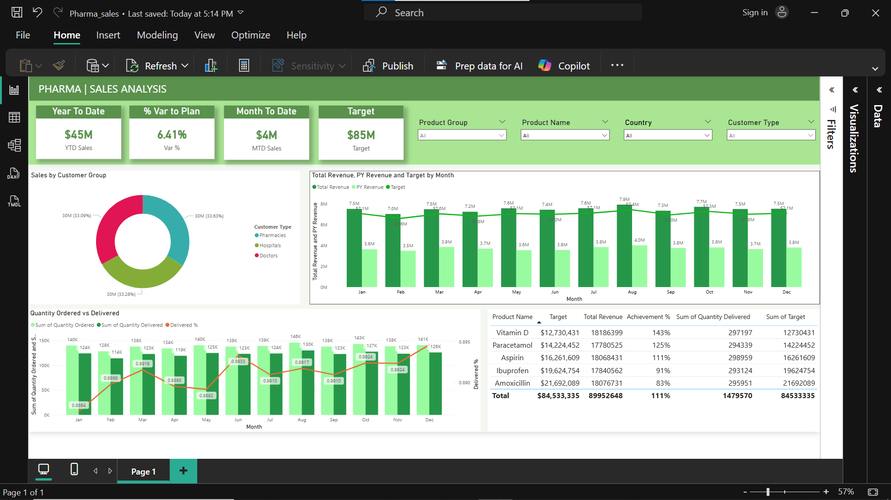

# 📊 Pharma Sales Analysis Dashboard

## 📌 Project Overview

This project is an interactive Power BI dashboard created to analyze pharmaceutical sales performance. The dashboard helps track revenue trends, target achievement, customer segmentation, and product performance using business KPIs and visual analytics.

---

# 🎯 Project Objectives

* Analyze pharmaceutical sales data
* Monitor revenue and sales targets
* Track product performance
* Compare ordered vs delivered quantities
* Identify high-performing customer groups
* Generate business insights using interactive dashboards

---

# 🛠 Tools Used

* Power BI Desktop
* Microsoft Excel
* DAX
* Power Query
* GitHub

---

# 📁 Files Included

| File Name                              | Description               |
| -------------------------------------- | ------------------------- |
| Pharma_sales.pbix                      | Power BI Dashboard File   |
| pharma_sales_project_dataset23,24.xlsx | Dataset used for analysis |
| Dashboard.png                          | Dashboard Screenshot      |
| README.md                              | Project Documentation     |

---

# 📊 Dashboard KPIs

* **YTD Sales:** $45M
* **MTD Sales:** $4M
* **Sales Target:** $85M
* **Variance to Plan:** 6.41%

---

# 📈 Dashboard Visuals

### Sales Analysis

* Sales by Customer Group
* Monthly Revenue Trend
* Target vs Revenue Analysis
* Quantity Ordered vs Delivered

### Product Insights

* Product Revenue Performance
* Achievement Percentage by Product
* Quantity Delivered Analysis

### Interactive Filters

* Product Group
* Product Name
* Country
* Customer Type

---

# 🔍 Key Insights

* Pharmacies generated the highest revenue contribution.
* Monthly revenue remained relatively stable across the year.
* Vitamin D and Paracetamol showed strong performance.
* Several products exceeded target achievement percentages.
* Delivery percentages fluctuated across months.
* Customer segmentation helped identify high-value business groups.

---

# 🚀 Business Impact

This dashboard helps businesses:

* Monitor sales performance
* Improve inventory planning
* Track target achievement
* Analyze customer behavior
* Identify profitable products

---

# 🧠 Skills Demonstrated

* Data Cleaning
* Data Transformation
* Data Visualization
* KPI Reporting
* Dashboard Design
* Business Analysis
* DAX Calculations

---

# 📷 Dashboard Preview

---

# 👨‍💻 Author

**Abdussami Sayyed**

🔗 LinkedIn: https://www.linkedin.com/feed/update/urn:li:activity:7455068950184333312/

Aspiring Data Analyst | Power BI | Excel | SQL | Python

